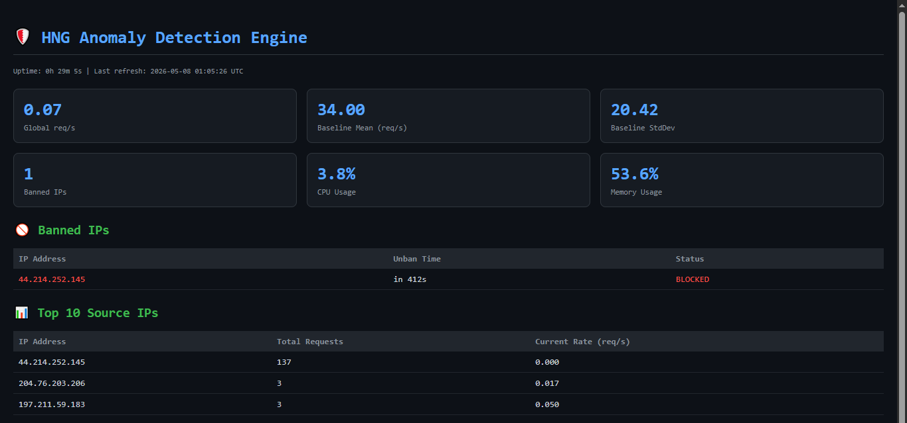

# HNG Stage 3 — Anomaly Detection Engine

A real-time DDoS and anomaly detection system built alongside Nextcloud.
Monitors HTTP traffic, learns normal patterns, and automatically blocks attackers.


---

## Live URLs

| Service | URL |
|---|---|
| **Metrics Dashboard** | http://daniel-detector.duckdns.org:8080 |
| **Server IP** | 44.214.252.145 |
| **Nextcloud** | http://44.214.252.145 (IP only) |

---

## Language Choice

Built in **Python** because:
- Rich standard library for data structures (`collections.deque`)
- `psutil` for system metrics (CPU/memory)
- `Flask` for lightweight dashboard
- `subprocess` for iptables integration
- Fast development cycle for daemon-style scripts

---

## Architecture

Internet Traffic
↓
Nginx (reverse proxy + JSON logs)
↓
HNG-nginx-logs (named Docker volume)
↓
Detector Daemon (runs on host)
↓              ↓              ↓
Block IPs       Slack Alerts    Dashboard
(iptables)      (webhook)       (Flask:9000)

### Repository Structure

hng-stage3/
├── detector/
│   ├── main.py         ← ties everything together
│   ├── monitor.py      ← tails and parses nginx logs
│   ├── baseline.py     ← rolling baseline calculation
│   ├── detector.py     ← anomaly detection logic
│   ├── blocker.py      ← iptables ban/unban
│   ├── unbanner.py     ← auto-unban background thread
│   ├── notifier.py     ← Slack alerts
│   ├── dashboard.py    ← live web UI
│   ├── config.yaml     ← all configuration
│   └── requirements.txt
├── nginx/
│   └── nginx.conf      ← JSON access log config
├── docs/
│   └── architecture.png
├── screenshots/
│   ├── Tool-running.png
│   ├── Ban-slack.png
│   ├── Unban-slack.png
│   ├── Global-alert-slack.png
│   ├── Iptables-banned.png
│   ├── Audit-log.png
│   └── Baseline-graph.png
├── docker-compose.yml
└── README.md

---

## How the Sliding Window Works

Two deque-based windows track request rates in real time.

### Per-IP Window
```python
from collections import deque
import time

ip_windows = {}  # {ip: deque of timestamps}

def record_request(ip):
    now = time.time()
    
    if ip not in ip_windows:
        ip_windows[ip] = deque()
    
    # Add current timestamp to right end
    ip_windows[ip].append(now)
    
    # Evict timestamps older than 60 seconds from left end
    cutoff = now - 60
    while ip_windows[ip] and ip_windows[ip][0] < cutoff:
        ip_windows[ip].popleft()
    
    # Rate = requests in window / window size
    rate = len(ip_windows[ip]) / 60
    return rate
```

### Global Window
Same structure but tracks ALL requests regardless of source IP.

### Why Deques?
- `append()` — O(1) — add new request instantly
- `popleft()` — O(1) — evict old request instantly
- Much faster than lists for this use case

### Eviction Logic
Every time a new request arrives:
1. Add timestamp to right end of deque
2. Check left end — is it older than 60 seconds?
3. If yes → remove it
4. Repeat until left end is within window
5. Count remaining items = requests in last 60 seconds

---

## How the Baseline Works

### Window Size
30 minutes of per-second request counts = up to 1,800 data points.

### Recalculation Interval
Every 60 seconds the mean and standard deviation are recalculated
from the rolling window and written to the audit log.

### Per-Hour Slots
Traffic varies by hour — morning vs night. The system maintains
separate data per hour:

```python
hourly_slots = {
    0:  [1.2, 0.8, 1.1],   # midnight
    9:  [5.2, 4.8, 6.1],   # morning rush
    14: [3.2, 2.8, 3.5],   # afternoon
}
```

**Priority rule:** If the current hour has 10+ samples, use that.
Otherwise fall back to the full 30-minute window.

### Floor Value
Minimum baseline of `1.0 req/s` prevents division-by-zero errors
and avoids false positives during very quiet periods.

### Baseline Formula
```python
mean   = sum(counts) / len(counts)
stddev = sqrt(sum((x - mean)^2 for x in counts) / len(counts))
```

---

## How Detection Works

An anomaly is flagged when **either** condition fires first:

### Condition 1 — Z-Score
```python
zscore = (current_rate - baseline_mean) / baseline_stddev
if zscore > 3.0:
    # Anomaly detected
```

Measures how many standard deviations above normal the current
rate is. A z-score above 3.0 means the traffic is extremely unusual.

### Condition 2 — Rate Multiplier
```python
if current_rate > 5 * baseline_mean:
    # Anomaly detected
```

Catches obvious attacks even before enough baseline data exists.

### Error Surge — Auto Threshold Tightening
If an IP's 4xx/5xx error rate exceeds 3x the baseline error rate,
thresholds automatically tighten to 70%:

```python
if error_rate > 3 * baseline_error_mean:
    zscore_threshold = 3.0 * 0.7   # 2.1
    rate_threshold   = 5.0 * 0.7   # 3.5
```

### Global vs Per-IP
- **Per-IP anomaly** → ban the IP + Slack alert
- **Global anomaly** → Slack alert only (no single IP to ban)

---

## How iptables Blocking Works

### Ban
```bash
iptables -I INPUT -s <ip> -j DROP
```
Inserts a DROP rule at the top of the INPUT chain.
All packets from that IP are silently discarded at the kernel level
before reaching Nginx or Nextcloud.

### Unban
```bash
iptables -D INPUT -s <ip> -j DROP
```
Removes the DROP rule — traffic from that IP flows normally again.

### Backoff Schedule
| Ban Number | Duration |
|---|---|
| 1st ban | 10 minutes |
| 2nd ban | 30 minutes |
| 3rd ban | 2 hours |
| 4th+ ban | Permanent |

The auto-unbanner runs in a background thread checking every
10 seconds and sends a Slack notification on every unban.

---

## Setup Instructions

### Prerequisites
- Ubuntu 22.04+ VPS (minimum 2 vCPU, 2GB RAM)
- Docker and Docker Compose installed
- A Slack workspace with an incoming webhook URL
- A domain or DuckDNS subdomain

### Step 1 — Clone the Repository
```bash
git clone https://github.com/LORDS-001/hng-stage3.git
cd hng-stage3
```

### Step 2 — Configure the Detector
```bash
nano detector/config.yaml
```

Fill in your values:
```yaml
slack:
  webhook_url: "https://hooks.slack.com/services/YOUR/WEBHOOK/URL"

whitelist:
  - "127.0.0.1"
  - "YOUR_SERVER_IP"
  - "YOUR_LOCAL_IP"
```

### Step 3 — Install Python Dependencies on Host
```bash
sudo pip3 install flask requests pyyaml psutil --break-system-packages
```

### Step 4 — Start the Docker Stack
```bash
docker compose up -d
docker compose ps
```

Expected output:

NAME        STATUS
nextcloud   Up (healthy)
nginx       Up

### Step 5 — Start the Detector
```bash
sudo python3 detector/main.py &
```

Or as a systemd service:
```bash
sudo systemctl enable hng-detector
sudo systemctl start hng-detector
sudo systemctl status hng-detector
```

### Step 6 — Verify Everything is Running
```bash
# Check Docker services
docker compose ps

# Check detector
ps aux | grep main.py | grep -v grep

# Check nginx logs are flowing
sudo tail -5 /var/lib/docker/volumes/HNG-nginx-logs/_data/hng-access.log

# Check dashboard
curl -s http://localhost:9000 | head -3
```

### Step 7 — Access the Dashboard

http://YOUR-SERVER-IP:8080

---

## Screenshots

### Tool Running


### Dashboard


### IP Banned in iptables


### Audit Log


### Slack Ban Alert


### Slack Unban Alert


---

## Audit Log Format

Every event is written in structured format:

[timestamp] ACTION ip | condition | rate | baseline | duration

Examples:

[2026-05-07 06:55:41 UTC] BAN 197.211.53.89 | condition=zscore=1.53 > 1.5 | rate=1.48 | baseline_mean=1.00 | duration=600s
[2026-05-07 07:05:47 UTC] UNBAN 197.211.53.89 | released from ban
[2026-05-07 06:56:07 UTC] BASELINE recalculated | mean=2.37 | stddev=0.97 | samples=70
[2026-05-07 06:56:05 UTC] GLOBAL_ANOMALY | condition=global zscore=4.90 > 1.5 | rate=2.55 | baseline_mean=1.00

---

## Configuration Reference

All thresholds are in `detector/config.yaml`:

| Key | Default | Description |
|---|---|---|
| `window_seconds` | 60 | Sliding window size |
| `baseline_window_minutes` | 30 | Rolling baseline window |
| `recalculation_interval` | 60 | Seconds between baseline updates |
| `zscore_threshold` | 3.0 | Z-score trigger threshold |
| `rate_multiplier_threshold` | 5.0 | Rate multiplier trigger |
| `error_rate_multiplier` | 3.0 | Error surge multiplier |
| `min_baseline_samples` | 10 | Minimum samples before baseline is used |
| `baseline_floor` | 1.0 | Minimum baseline mean |

---

## GitHub Repository
https://github.com/LORDS-001/hng-stage3

## Blog Post
[How I Built a Real-Time DDoS Detection Engine from Scratch](https://lords001.hashnode.dev/how-i-built-a-real-time-ddos-detection-engine-from-scratch)

---

*HNG Internship 14 — DevSecOps Track — Stage 3*